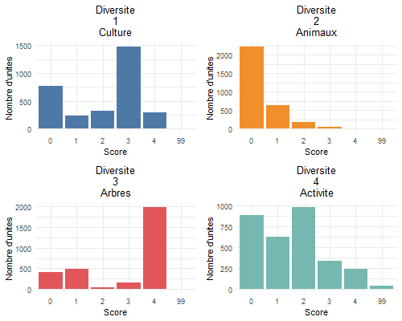
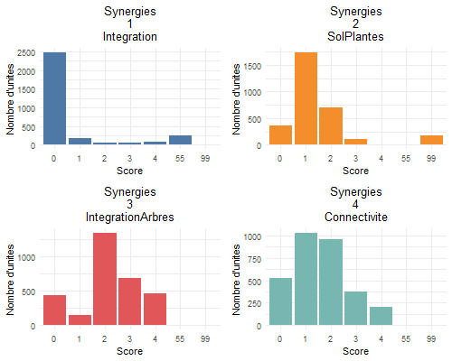
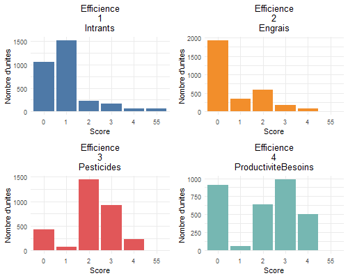
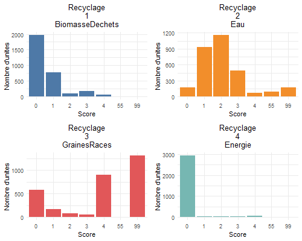
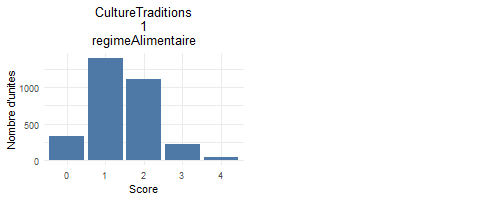
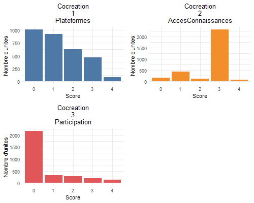
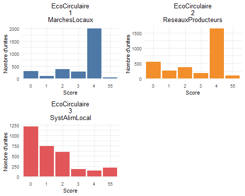
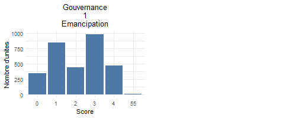

# rga23_tape

## Utiles
- Tous les programmes R liés à cette analyse sont disponibles dans le dossier Tape du repository [rga23](https://github.com/nathalieDubreu/rga23) 
- Dictionnaire des variables et modalités du RGA (à télécharger depuis la racine du projet)

## **Champ** : 
- Les exploitations éligibles au RGA 2023 en cultures ou en élevages respectant les seuils de la CAPL (400 points ou plus - cf. [annexe de l’arrêté n° 668 CM du 6 mai 2013 relatif à la Chambre et au registre de l'agriculture et de la pêche lagonaire (partie I - Activités agricoles)](2023_06_08_maj_Annexe.pdf))
- Hors points liés aux 2,7 tonnes de coprah
- => 3094 unités

## Rappel des limites du RGA dans le cadre de l'analyse TAPE
- Seuls les chefs d'exploitations sont interrogés (pas les travailleurs) 
- Pas de déclinaison hommes/femmes dans les catégories et sous-catégories ni selon l'âge des travailleurs

## Catégories et sous-catégories traitées
    - Score allant de 0 à 4 selon les index
    - Code 55 -> exploitations non classées (acceptable jusqu'à 10% du nombre d'exploitations)
    - Code 99 -> exploitations non concernées

- [Diversité](CriteresCategories/1-Diversity.md)
    
| score | Diversite_1_Culture | Diversite_2_Animaux | Diversite_3_Arbres | Diversite_4_Activite |
|-------|----------------------|---------------------|--------------------|-----------------------|
| 0     | 774                  | 2223                | 411                | 879                   |
| 1     | 231                  | 641                 | 486                | 620                   |
| 2     | 321                  | 177                 | 51                 | 978                   |
| 3     | 1476                 | 53                  | 162                | 336                   |
| 4     | 292                  | --                  | 1984               | 238                   |
| 99    | --                   | --                  | --                 | 43                    |

- [Synergies](CriteresCategories/2-Synergies.md)
      
| score | Synergies_1_Integration | Synergies_2_SolPlantes | Synergies_3_IntegrationArbres | Synergies_4_Connectivite |
|-------|-------------------------|------------------------|-------------------------------|--------------------------|
| 0     | 2475                    | 366                    | 441                           | 522                      |
| 1     | 182                     | 1736                   | 145                           | 1027                     |
| 2     | 57                      | 706                    | 1347                          | 959                      |
| 3     | 51                      | 108                    | 691                           | 378                      |
| 4     | 76                      | 7                      | 470                           | 208                      |
| 55    | 253                     | --                     | --                            | --                       |
| 99    | --                      | 171                    | --                            | --                       |

- [Efficience](CriteresCategories/3-Efficience.md)
 
| score | Efficience_1_Intrants | Efficience_2_Engrais | Efficience_3_Pesticides | Efficience_4_ProductiviteBesoins |
|-------|------------------------|----------------------|-------------------------|----------------------------------|
| 0     | 1061                   | 1922                 | 435                     | 906                              |
| 1     | 1521                   | 338                  | 70                      | 59                               |
| 2     | 222                    | 588                   | 1447                    | 637                              |
| 3     | 167                    | 171                  | 918                     | 985                              |
| 4     | 60                     | 75                   | 224                     | 507                              |
| 55    | 63                     | --                   | --                      | --                               |

- [Recyclage](CriteresCategories/4-Recyclage.md)

| score | Recyclage_1_BiomasseDechets | Recyclage_2_Eau | Recyclage_3_GrainesRaces | Recyclage_4_Energie |
|-------|------------------------------|-----------------|--------------------------|---------------------|
| 0     | 1970                         | 175             | 583                      | 2939                |
| 1     | 780                          | 935             | 171                      | 28                  |
| 2     | 104                          | 1159             | 74                       | 25                  |
| 3     | 182                          | 492              | 56                       | 44                  |
| 4     | 58                           | 73              | 898                      | 58                  |
| 55    | --                           | 89              | --                       | --                  |
| 99    | --                           | 171             | 1312                     | --                  |

- [Résilience](CriteresCategories/5-Resilience.md)

| score | Resilience_1_StabiliteProduction | Resilience_2_ReductionVulnerabilite |
|-------|----------------------------------|-------------------------------------|
| 0     | 51                                | 1826                                |
| 1     | 657                               | 22                                  |
| 2     | 1452                              | 905                                 |
| 3     | 581                               | 329                                 |
| 4     | 80                                | 2                                   |
| 55    | --                                | 10                                  |
| 99    | 273                               | --                                  |

- [Culture et traditions alimentaires](CriteresCategories/6-CultureTraditions.md)

| score | CultureTraditions_1_regimeAlimentaire   |
|-------|-----|
| 0     | 327 |
| 1     | 1395|
| 2     | 1112|
| 3     | 219 |
| 4     | 41  |

- [Cocreation](CriteresCategories/7-Cocreation.md)

| score | Cocreation_1_Plateformes | Cocreation_2_AccesConnaissances | Cocreation_3_Participation |
|-------|--------------------------|---------------------------------|----------------------------|
| 0     | 1008                     | 170                             | 2162                       |
| 1     | 923                      | 425                             | 330                        |
| 2     | 621                      | 113                             | 281                        |
| 3     | 463                      | 2307                            | 189                        |
| 4     | 79                       | 79                              | 132                        |

- [Valeurs humaines et sociales](CriteresCategories/8-ValeursHumainesSociales.md)

| score | ValeursHumaines_2_Travail | ValeursHumaines_4_BienEtreAnimal |
|-------|----------------------------|----------------------------------|
| 0     | 45                         | 34                               |
| 1     | 886                        | 79                               |
| 2     | 970                        | 100                              |
| 3     | 897                        | 32                               |
| 4     | --                         | 41                               |
| 55    | 296                        | 585                              |
| 99    | --                         | 2223                             |

- [Econome circulaire et solidaire](CriteresCategories/9-EconomieCirculaire.md)

| score | EcoCirculaire_1_MarchesLocaux | EcoCirculaire_2_ReseauxProducteurs | EcoCirculaire_3_SystAlimLocal |
|-------|--------------------------------|-------------------------------------|-------------------------------|
| 0     | 298                            | 551                                 | 1213                          |
| 1     | 94                             | 260                                 | 738                           |
| 2     | 374                            | 370                                 | 594                           |
| 3     | 281                            | 180                                 | 184                           |
| 4     | 2000                           | 1636                                | 143                           |
| 55    | 47                             | 97                                  | 222                           |

- [Gouvernance](CriteresCategories/10-Gouvernance.md)

| score | Gouvernance_1_Emancipation |
|-------|----------------------------|
| 0     | 351                        |
| 1     | 847                        |
| 2     | 440                        |
| 3     | 976                        |
| 4     | 468                        |
| 55    | 12                         |

## WIP
- [Récapitulatif avancement](Recapitulatif.md)

## Sous-catégories Tape NON traitées via le RGA

- 6.2 IDENTITÉ ET CONSCIENCE LOCALES OU TRADITIONNELLES (PAYSANNES/INDIGÈNES)
- 6.3 UTILISATION DE VARIETÉS/RACES LOCALES ET CONNAISSANCES TRADITIONNELLES (PAYSANNES / INDIGÈNES) POUR LA PRÉPARATION DES ALIMENTS
- 8.1 ÉMANCIPATION DES FEMMES
- 8.3 ÉMANCIPATION DE LA JEUNESSE ET ÉMIGRATION
- 10.2 ORGANIZATIONS ET ASSOCIATIONS DE PRODUCTEURS
- 10.3 PARTICIPATION DES PRODUCTEURS DANS LA GOUVERNANCE DE LA TERRE ET DES RESSOURCES NATURELLES

